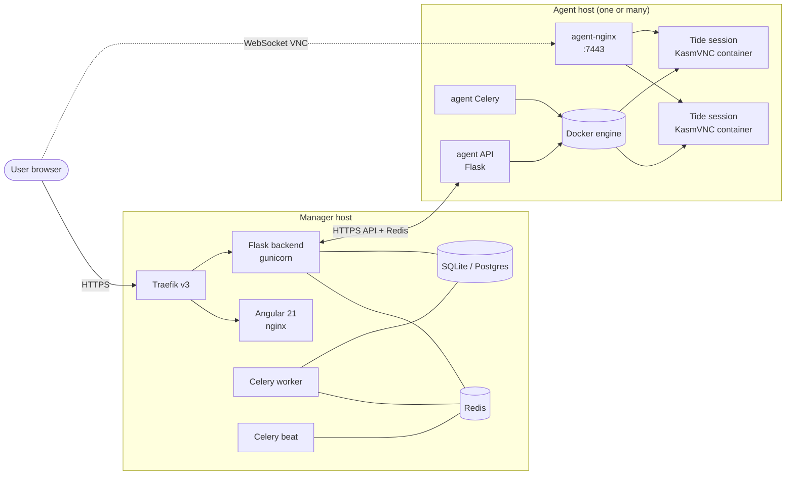

# Tidalcase

> Self-hosted container streaming platform.

[](LICENSE)
[]()
[](https://www.docker.com/)
[](https://flask.palletsprojects.com/)
[](https://angular.dev/)

Tidalcase lets you run desktop environments and GUI applications inside Docker
containers and stream them straight into a web browser. Open a tide, get a
fully-isolated workspace; close it, the container goes away.

It is a ground-up rewrite of [flowcase](https://github.com/flowcase/flowcase),
built around [KasmVNC](https://github.com/kasmtech/KasmVNC) for the streaming
layer, with a Flask + Celery backend, an Angular 21 frontend, and a pluggable
agent system for running sessions across multiple Docker hosts.

---

## Table of contents

- [Features](#features)
- [Architecture](#architecture)
- [Quick start](#quick-start)
- [Repository layout](#repository-layout)
- [Documentation](#documentation)
- [Default credentials](#default-credentials)
- [Upgrading](#upgrading)
- [License](#license)
- [Credits](#credits)

---

## Features

- **Streaming desktops and apps** — KasmVNC sessions delivered through a
  browser, no VNC client needed.
- **Tides** — declarative definitions of what a session looks like (image,
  CPU/memory limits, mounts, network, env). Launch one with a click.
- **Multi-host scheduling** — register one or more **agents** on remote Docker
  hosts; the manager schedules tide sessions across them based on capacity.
- **Pluggable authentication** — local users, LDAP, OIDC and Azure AD, with
  optional TOTP MFA. Authentik can be deployed alongside as a reverse-proxy
  SSO.
- **RBAC** — users belong to groups, groups carry permissions; everything
  configurable from the admin UI.
- **Storage providers** — mount remote storage (anything `rclone` speaks) into
  tide sessions on launch.
- **Private registry** — optional bundled Docker registry for hosting your own
  tide images, with image-prefix and icon support.
- **Async tasks** — Celery worker + beat handle long-running jobs (agent
  health checks, prune, image pulls) without blocking the API.
- **TLS by default** — Traefik fronts everything and handles certificates.

---

## Architecture



The manager runs the UI, the API and the database. Agents run on the hosts
that actually launch tide containers. The browser hits the manager for
authentication and session brokering, then connects directly to the chosen
agent's nginx (port 7443) for the VNC WebSocket stream.

---

## Quick start

### Prerequisites

- Docker Engine 24+ and Docker Compose v2
- A host reachable on ports 80 and 443 (for Traefik)
- At least 2 GB RAM and 10 GB free disk for the manager itself; tide sessions
  need their own resources on top
- TLS certificates placed under `/etc/tidalcase/certs/` (Traefik reads them
  from there via its file provider). For local testing, self-signed is fine.

### Bring up the manager

```bash
git clone https://github.com/<your-org>/tidalcase.git
cd tidalcase

cp .env.example .env
# edit .env — at minimum set DOMAIN and SECRET_KEY
# generate a SECRET_KEY:  openssl rand -hex 32

docker compose up -d
```

After a few seconds the manager UI is reachable at `https://<DOMAIN>`.

By default the stack uses **SQLite** stored in the `tidalcase-data` volume —
fine for evaluation. For production, switch to PostgreSQL by editing
`DATABASE_URL` in your `.env` and (optionally) enabling the bundled Postgres:

```bash
docker compose --profile db up -d
```

See [`docs/deployment.md`](docs/deployment.md) for full deployment guidance,
TLS setup, backups, and switching to Postgres.

### Adding an agent host

The manager alone can't run tide sessions — you need at least one agent. The
agent profile is in the same `docker-compose.yml`, and you'd usually run it on
a different host:

```bash
# On the agent host
git clone https://github.com/<your-org>/tidalcase.git
cd tidalcase
cp .env.example .env
# edit .env: set TIDALCASE_JOIN_TOKEN (from the manager UI),
#            TIDALCASE_MANAGER_URL, TIDALCASE_AGENT_URL
docker compose --profile agent up -d
```

See [`docs/agents.md`](docs/agents.md) for the full agent registration
procedure.

### Optional profiles

| Profile     | What it adds                                            |
| ----------- | ------------------------------------------------------- |
| `db`        | Bundled PostgreSQL (`tidalcase-postgres`)               |
| `auth`      | Authentik SSO server + worker                           |
| `registry`  | Bundled Docker registry for your tide images            |
| `agent`     | Agent stack (run this on each Docker host that hosts sessions) |

Combine them like `docker compose --profile db --profile auth up -d`.

---

## Repository layout

```
tidalcase/
├── backend/          Flask API, SQLAlchemy models, Celery tasks, migrations
├── frontend/         Angular 21 app (PrimeNG + Tailwind, based on Sakai)
├── agent/            Agent service + nginx (run on each tide host)
├── guac/             Optional Guacamole-lite WebSocket VNC proxy
├── registry/         Bundled Docker registry image
├── docs/             Documentation (deployment, configuration, agents, …)
├── docker-compose.yml
├── .env.example
└── LICENSE
```

---

## Documentation

| Guide                                              | What's in it                                            |
| -------------------------------------------------- | ------------------------------------------------------- |
| [`docs/deployment.md`](docs/deployment.md)         | Production install: services, volumes, TLS, backups    |
| [`docs/configuration.md`](docs/configuration.md)   | Every `.env` variable, admin panel overview            |
| [`docs/agents.md`](docs/agents.md)                 | Adding agent hosts, join tokens, capacity              |
| [`docs/auth-providers.md`](docs/auth-providers.md) | Local, LDAP, OIDC, Azure AD, MFA                       |
| [`docs/storage.md`](docs/storage.md)               | rclone-backed storage mounts for tide sessions         |
| [`docs/troubleshooting.md`](docs/troubleshooting.md) | Common issues and how to recover                      |

---

## Default credentials

On the very first start the backend bootstraps an `admin` user and writes the
generated password to `backend/credentials.txt` inside the
`tidalcase-data` volume. Retrieve it with:

```bash
docker compose exec tidalcase-backend cat /app/data/credentials.txt
```

Change this password immediately after first login (Profile → Change password)
and delete the file from the volume.

---

## Upgrading

Upgrades go tag-to-tag:

1. Back up the `tidalcase-data` volume (and your Postgres if you use one) —
   see [`docs/deployment.md`](docs/deployment.md#backups).
2. Pull the new images and restart the stack:

   ```bash
   docker compose pull
   docker compose up -d
   ```

3. The backend runs any pending Alembic migrations on start; check
   `docker compose logs tidalcase-backend` if you want to see them.

Release notes for each tag call out anything that needs manual intervention
(env-var changes, schema migrations that require downtime, etc.).

---

## License

Released under the [MIT License](LICENSE).

Tidalcase is built on top of, and ships, third-party software with its own
licenses — most notably KasmVNC, Traefik, Angular, PrimeNG (Sakai template),
Flask and Celery. See each project's repository for terms.

---

## Credits

- [flowcase](https://github.com/flowcase/flowcase) — the original project this
  one is a rewrite of.
- [KasmVNC](https://github.com/kasmtech/KasmVNC) — the streaming layer that
  makes tide sessions possible.
- [Sakai-NG](https://github.com/primefaces/sakai-ng) — Angular admin template
  the frontend is based on.
